# Plotly Plasma

Plotly Plasma is a small opinionated enhancement for the [Plotly for
Python](https://plotly.com/python/) library. It patches the Plotly
Figure object, adding new methods to handle somewhat frequent use cases
that would normally take some boilerplate code to solve.

Simply `import plasma`, and you are good to go!

-   [Multiple y-axes](#Multiple-y-axes)
-   [Year over year comparison](#Year-over-year-comparison)
-   [Multiple colors in a single
    line](#Multiple-colors-in-a-single-line)
-   [Multiple lines with continuous
    colormap](#Multiple-lines-with-continuous-colormap)
-   [Facets](#Facets)


# Multiple y-axes

When the values of the metrics are in very different scales, Plotly
doesn't have a quick way to produce dual axes.

The default function will use the largest axis, and small variances will
be barely noticeable.

``` {.python .cell-code}
px.line(data[["sinoid_0", "sinoid_9"]])
```

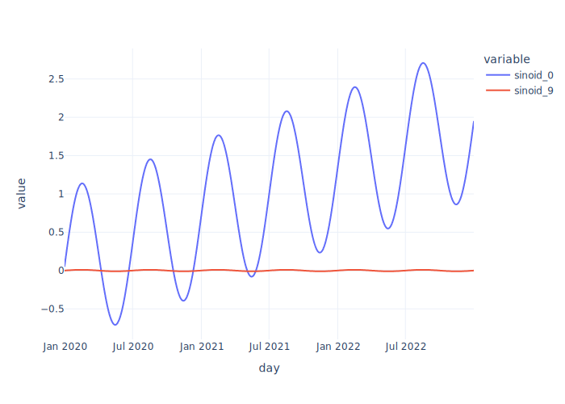

Plasma will let you easily do that with `.dual`, which will make the
first column the left axis and the second column the right axis.

``` {.python .cell-code}
fig = px.line(data[["sinoid_0", "sinoid_9"]]).dual()
fig
```

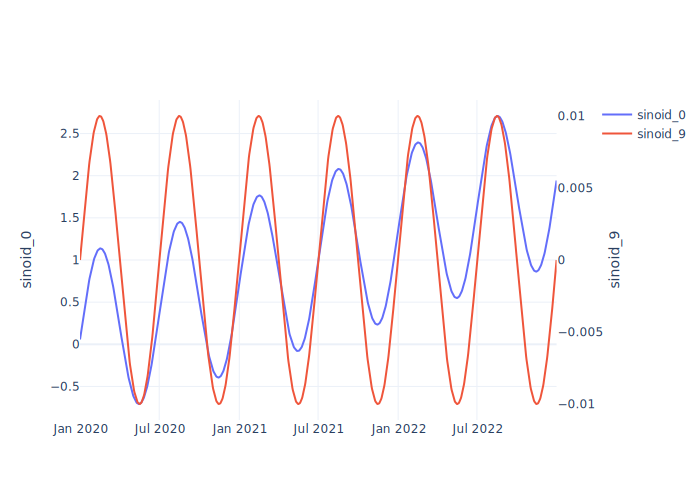

# Year-over-year comparison

When comparing timeseries, it is useful to overlay the same period of
different years.

``` {.python .cell-code}
fig = px.line(data, y="sinoid_0", color=data.index.year)
fig
```

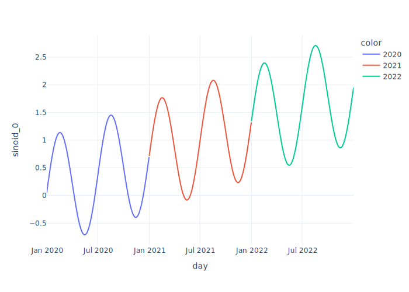

You can use `.yoy` to do that, as long as the x-axis is a datetime.

``` {.python .cell-code}
fig.yoy()
```

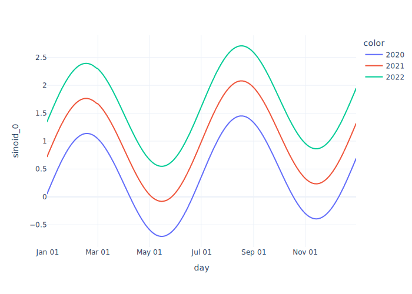

# Multiple colors in a single line

By default, when you pass a `column` to the `color` parameter, it will
use one line for every color value. Sometimes, we want a single line to
have multiple colors, for example, to highlight a specific period.

``` {.python .cell-code}
def add_month_condition(df):
    s = np.select(
        [
            data.index.month == 1,
            data.index.month == 6,
        ],
        ["january", "june"],
        default="rest of year",
    )
    return df.assign(month_condition=s)


fig = px.line(
    data.pipe(add_month_condition),
    y="sinoid_0",
    color="month_condition",
)
fig
```

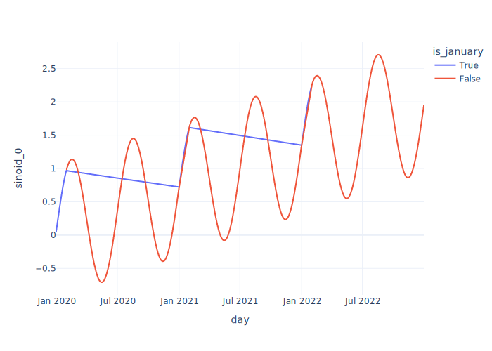

You can use `.single_line` to do that.

``` {.python .cell-code}
fig.single_line()
```

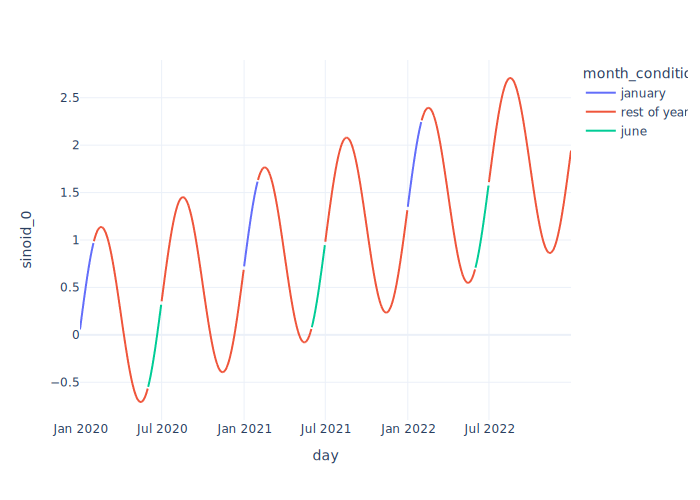

# Multiple lines with continuous colormap

Still on the color topic, Plotly will use a discrete colormap by
default, which is not always the best option.

``` {.python .cell-code}
fig = px.line(
    tall_format,
    x="day",
    y="value",
    color="senoid_average",
)
fig
```

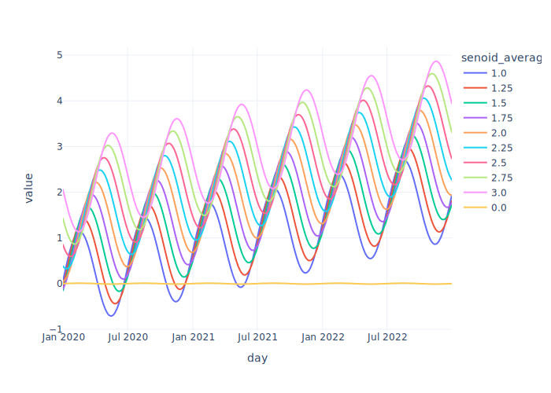

You can use `.continuous_color` to fix that. You can also pass a
`colorscale` parameter to define the colormap, which can be any of the
[Plotly colormaps](https://plotly.com/python/builtin-colorscales/).

``` {.python .cell-code}
fig.continuous_color('Tropic')
```

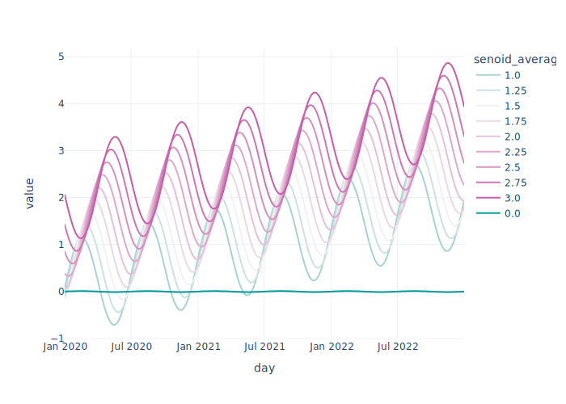

# Facets

Default facets have a `column_name=column_value` labels for facets,
which I find almost always undesirable.

``` {.python .cell-code}
fig = px.line(
    tall_format,
    x="day",
    y="value",
    facet_row="variable",
    facet_col="is_even",
    facet_col_spacing=0.05,
)
fig
```

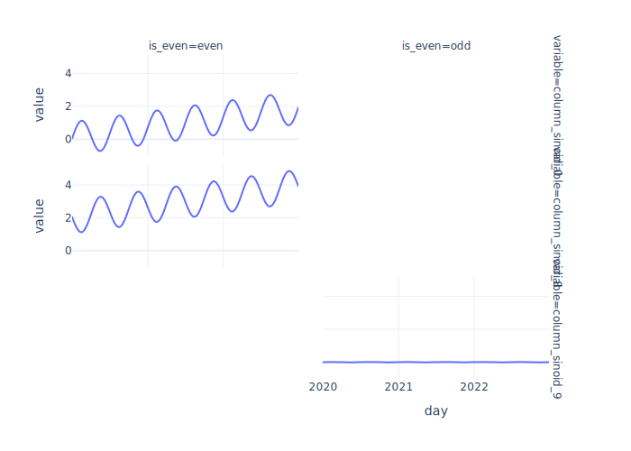

You can fix those with `fix_facets_labels`.

``` {.python .cell-code}
fig.fix_facet_labels()
```

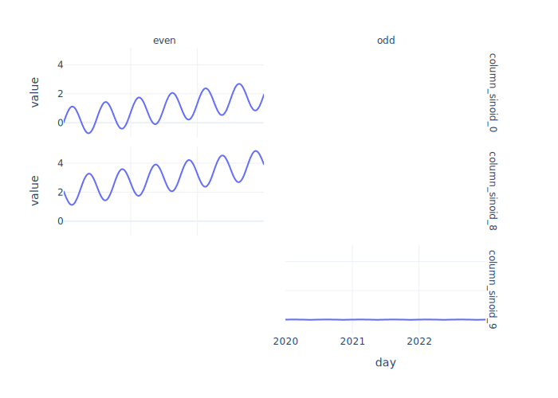

You can also pass any keyworks that would be accepted by the
[annotation.update](https://plotly.com/python/reference/layout/annotations/#layout-annotations)

``` {.python .cell-code}
fig.fix_facet_labels(
    font_size=12,
    font_family="Courier New",
    bgcolor="lightgrey",
)
```

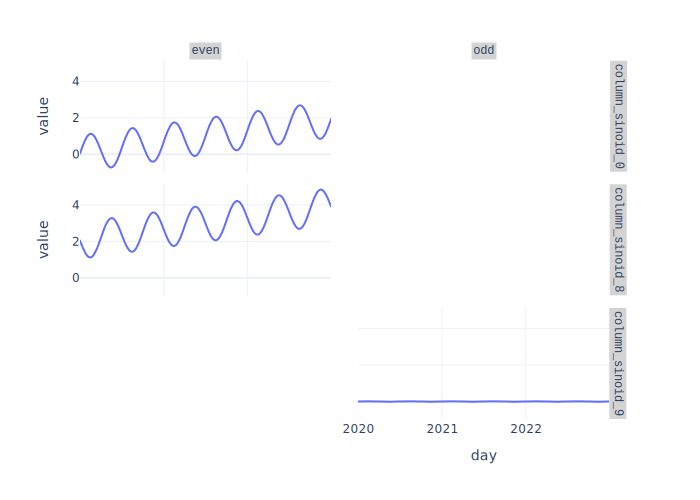
