# Plotly Patcher

Plotly Patcher is an opinionated thin wrapper that patches the Figure object from [Plotly](https://github.com/plotly/plotly.py) to add some functionatilies. These implement or fix some use cases commonly encountered when using the library:

- [Multiple y-axes](#Multiple-y-axes)
- [Year over year comparison](#Year-over-year-comparison)
- [Multiple colors in a single line](#Multiple-colors-in-a-single-line)
- [Multiple lines with continuous colormap](#Multiple-lines-with-continuous-colormap)
- [Facets](#Facets)

# Examples

Let's first generate some data.


```python
import pandas as pd
import numpy as np
import matplotlib.pyplot as plt
import plasma
import plotly.express as px
import plotly.io as pio
pio.renderers.default = "svg"
pio.templates.default = "plotly_white"
```


```python
df_index = pd.date_range("2020-01-01", "2022-12-31", freq="D", name="day")
n_samples = df_index.shape[0]
x_array = np.linspace(-np.pi * 6, np.pi * 6, n_samples)
noise = np.random.random(df_index.shape[0])


def sinoid(x_lag, y_multiplier, linear_coefficient):
    return np.sin(x_array - x_lag) * y_multiplier + linear_coefficient


y_arrays = [
    sinoid(x_lag, y_multiplier, linear_coefficient) + x_array/20
    for x_lag, y_multiplier, linear_coefficient in zip(
        np.linspace(0, np.pi, 9), [1] * 9, np.linspace(1, 3, 9)
    )
]
y_arrays.append(sinoid(0, 0.01, 0))
data = pd.DataFrame(y_arrays).T.set_index(df_index)
data.columns = [f"sinoid_{i}" for i in range(10)]
data.head()

```


<div>
<style scoped>
    .dataframe tbody tr th:only-of-type {
        vertical-align: middle;
    }

    .dataframe tbody tr th {
        vertical-align: top;
    }

    .dataframe thead th {
        text-align: right;
    }
</style>
<table border="1" class="dataframe">
  <thead>
    <tr style="text-align: right;">
      <th></th>
      <th>sinoid_0</th>
      <th>sinoid_1</th>
      <th>sinoid_2</th>
      <th>sinoid_3</th>
      <th>sinoid_4</th>
      <th>sinoid_5</th>
      <th>sinoid_6</th>
      <th>sinoid_7</th>
      <th>sinoid_8</th>
      <th>sinoid_9</th>
    </tr>
    <tr>
      <th>day</th>
      <th></th>
      <th></th>
      <th></th>
      <th></th>
      <th></th>
      <th></th>
      <th></th>
      <th></th>
      <th></th>
      <th></th>
    </tr>
  </thead>
  <tbody>
    <tr>
      <th>2020-01-01</th>
      <td>0.057522</td>
      <td>-0.075161</td>
      <td>-0.149585</td>
      <td>-0.116357</td>
      <td>0.057522</td>
      <td>0.383643</td>
      <td>0.850415</td>
      <td>1.424839</td>
      <td>2.057522</td>
      <td>7.347881e-18</td>
    </tr>
    <tr>
      <th>2020-01-02</th>
      <td>0.093665</td>
      <td>-0.041412</td>
      <td>-0.123104</td>
      <td>-0.100916</td>
      <td>0.059836</td>
      <td>0.372739</td>
      <td>0.828216</td>
      <td>1.394986</td>
      <td>2.024822</td>
      <td>3.442161e-04</td>
    </tr>
    <tr>
      <th>2020-01-03</th>
      <td>0.129767</td>
      <td>-0.007246</td>
      <td>-0.095815</td>
      <td>-0.084396</td>
      <td>0.063335</td>
      <td>0.362945</td>
      <td>0.806883</td>
      <td>1.365623</td>
      <td>1.992163</td>
      <td>6.880243e-04</td>
    </tr>
    <tr>
      <th>2020-01-04</th>
      <td>0.165788</td>
      <td>0.027296</td>
      <td>-0.067748</td>
      <td>-0.066814</td>
      <td>0.068016</td>
      <td>0.354275</td>
      <td>0.786444</td>
      <td>1.336789</td>
      <td>1.959585</td>
      <td>1.031017e-03</td>
    </tr>
    <tr>
      <th>2020-01-05</th>
      <td>0.201687</td>
      <td>0.062177</td>
      <td>-0.038934</td>
      <td>-0.048190</td>
      <td>0.073875</td>
      <td>0.346741</td>
      <td>0.766925</td>
      <td>1.308518</td>
      <td>1.927129</td>
      <td>1.372788e-03</td>
    </tr>
  </tbody>
</table>
</div>


```python
px.line(data)

```


    
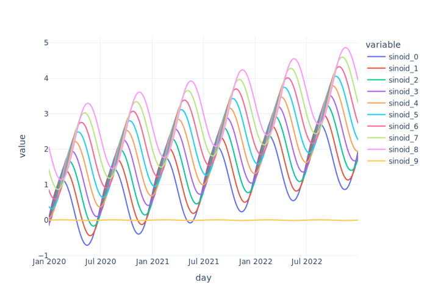
    


# Multiple y-axes

When the values of the metrics are in very different scales, Plotly doesnt have an easy way to produce dual axes.

The default function will use the largest axis, and small variances will be barely noticeable.


```python
px.line(data[["sinoid_0", "sinoid_9"]])
```


    
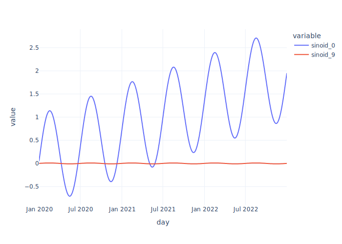
    


You can easily do that with `.dual`, which will make the first column the left axis and the second column the right axis. 


```python
fig = px.line(data[["sinoid_0", "sinoid_9"]]).dual()
fig
```


    
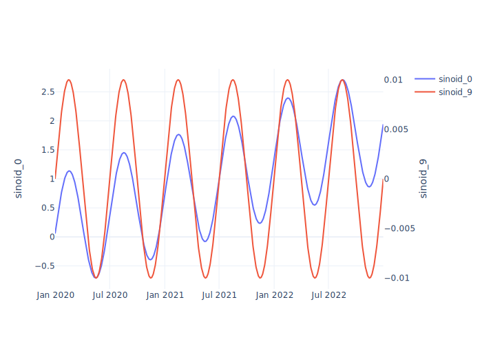
    


# Year-over-year comparison
When comparing timeseries, it is useful to overlay the same period of different years.


```python
fig = px.line(data, y="sinoid_0", color=data.index.year)
fig

```


    
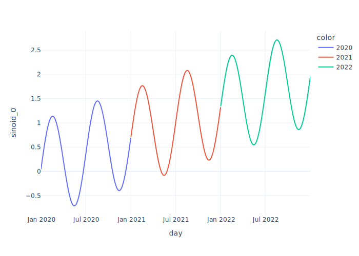
    


You can use `.yoy` to do that, as long as the index is a datetime.


```python
fig.yoy()
```


    
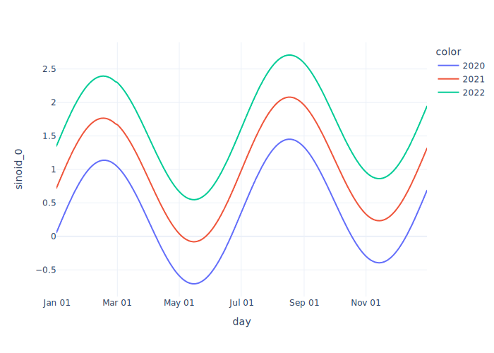
    


# Multiple colors in a single line
By default, when you pass a `column` to the `color` parameter, it will use one color for every line. Sometimes, we want a single line to have multiple colors, for example, to highlight a specific period.


```python
single_line_example = data.assign(is_january=lambda df: df.index.month == 1)

fig = px.line(
    single_line_example,
    y="sinoid_0",
    color="is_january",
)

```


```python
fig
```


    
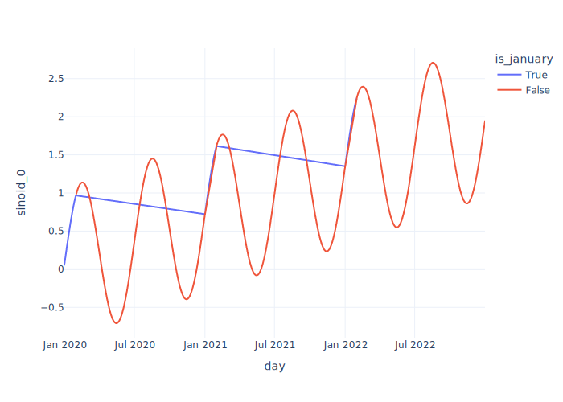
    


You can use `.single_line` to do that.


```python
fig.single_line()
```


    
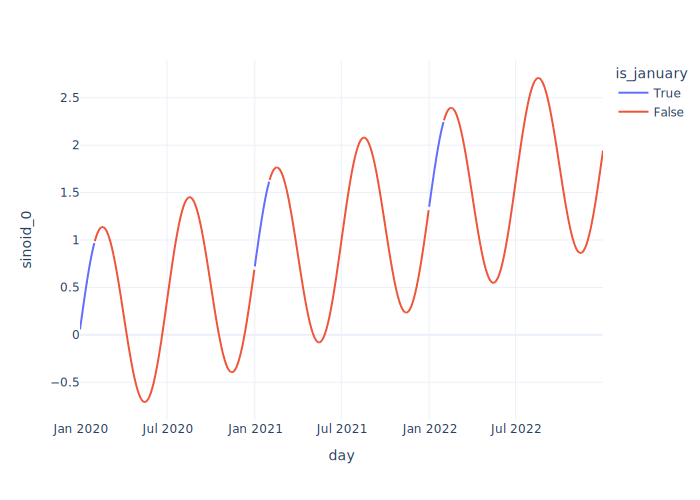
    


# Multiple lines with continuous colormap
Still on the color topic, Plotly will use a discrete colormap by default, which is not always the best option.


```python
tall_format = data.reset_index().melt(id_vars='day')
tall_format.head()

```


<div>
<style scoped>
    .dataframe tbody tr th:only-of-type {
        vertical-align: middle;
    }

    .dataframe tbody tr th {
        vertical-align: top;
    }

    .dataframe thead th {
        text-align: right;
    }
</style>
<table border="1" class="dataframe">
  <thead>
    <tr style="text-align: right;">
      <th></th>
      <th>day</th>
      <th>variable</th>
      <th>value</th>
    </tr>
  </thead>
  <tbody>
    <tr>
      <th>0</th>
      <td>2020-01-01</td>
      <td>sinoid_0</td>
      <td>0.057522</td>
    </tr>
    <tr>
      <th>1</th>
      <td>2020-01-02</td>
      <td>sinoid_0</td>
      <td>0.093665</td>
    </tr>
    <tr>
      <th>2</th>
      <td>2020-01-03</td>
      <td>sinoid_0</td>
      <td>0.129767</td>
    </tr>
    <tr>
      <th>3</th>
      <td>2020-01-04</td>
      <td>sinoid_0</td>
      <td>0.165788</td>
    </tr>
    <tr>
      <th>4</th>
      <td>2020-01-05</td>
      <td>sinoid_0</td>
      <td>0.201687</td>
    </tr>
  </tbody>
</table>
</div>


```python
tall_format["senoid_average"] = (
    tall_format.groupby("variable")["value"].transform("mean").round(2)
)
fig = px.line(tall_format, x="day", y="value", color="senoid_average")
fig

```


    
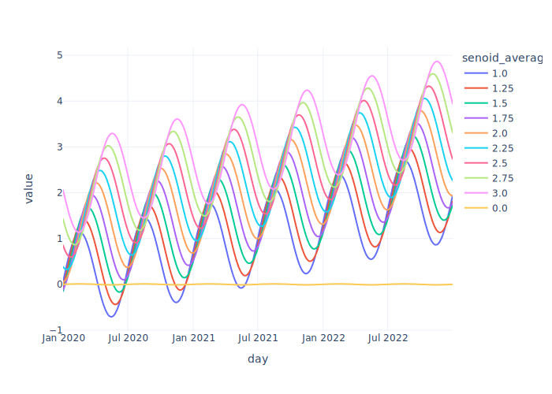
    


You can use `.continuous_color` to fix that. You can also pass a `colorscale` parameter to define the colormap, which can be any of the [Plotly colormaps](https://plotly.com/python/builtin-colorscales/).


```python
fig.continuous_color(colorscale="Tropic")
```


    
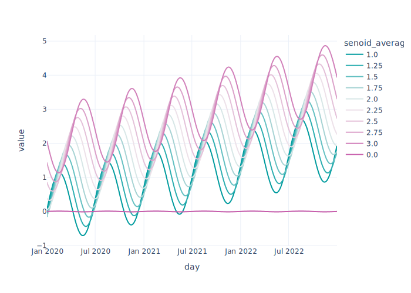
    


# Facets
Default facets have a `column_name=column_value` labels for facets, which I find almost always undesirable.


```python
tall_format = (
    data[["sinoid_0", "sinoid_8", "sinoid_9"]]
    .reset_index()
    .melt(id_vars="day")
    .assign(
        is_even=lambda df: (
            df.variable.str.split("_", expand=True)[1].astype(int) % 2 == 0
        ).map({True: "even", False: "odd"}),
        variable=lambda df: "column_" + df.variable,
    )
)
tall_format.head()
```


<div>
<style scoped>
    .dataframe tbody tr th:only-of-type {
        vertical-align: middle;
    }

    .dataframe tbody tr th {
        vertical-align: top;
    }

    .dataframe thead th {
        text-align: right;
    }
</style>
<table border="1" class="dataframe">
  <thead>
    <tr style="text-align: right;">
      <th></th>
      <th>day</th>
      <th>variable</th>
      <th>value</th>
      <th>is_even</th>
    </tr>
  </thead>
  <tbody>
    <tr>
      <th>0</th>
      <td>2020-01-01</td>
      <td>column_sinoid_0</td>
      <td>0.057522</td>
      <td>even</td>
    </tr>
    <tr>
      <th>1</th>
      <td>2020-01-02</td>
      <td>column_sinoid_0</td>
      <td>0.093665</td>
      <td>even</td>
    </tr>
    <tr>
      <th>2</th>
      <td>2020-01-03</td>
      <td>column_sinoid_0</td>
      <td>0.129767</td>
      <td>even</td>
    </tr>
    <tr>
      <th>3</th>
      <td>2020-01-04</td>
      <td>column_sinoid_0</td>
      <td>0.165788</td>
      <td>even</td>
    </tr>
    <tr>
      <th>4</th>
      <td>2020-01-05</td>
      <td>column_sinoid_0</td>
      <td>0.201687</td>
      <td>even</td>
    </tr>
  </tbody>
</table>
</div>


```python
fig = px.line(
    tall_format,
    x="day",
    y="value",
    facet_row="variable",
    facet_col="is_even",
    facet_col_spacing=0.05,
)
fig
```


    
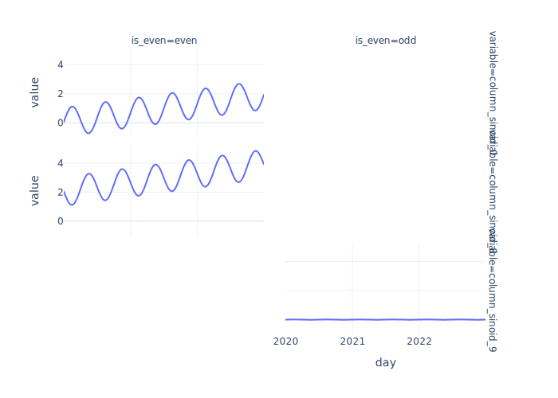
    


You can fix those with `fix_facets_labels`.


```python
fig.fix_facet_labels()
```


    
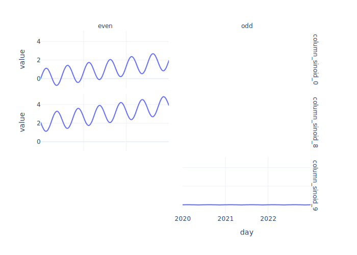
    


You can also pass any keyworks that would be accepted by the [annotation.update](https://plotly.com/python/reference/layout/annotations/#layout-annotations)


```python
fig.fix_facet_labels(
    font_size=12,
    font_family="Courier New",
    bgcolor="lightgrey",
)
```


    
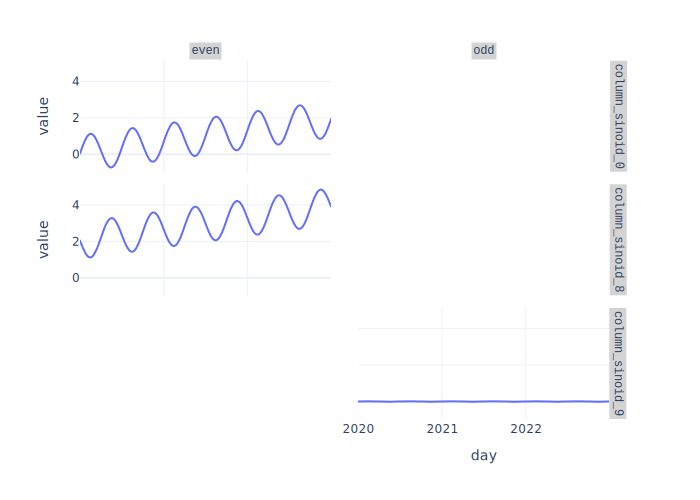
    

