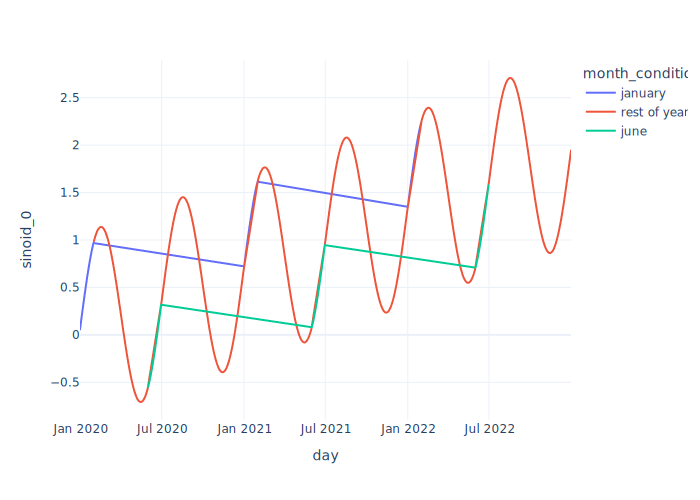

Plotly Patcher is an opinionated thin wrapper that patches the Figure
object from [Plotly](https://github.com/plotly/plotly.py) to add some
functionatilies. These implement or fix some use cases commonly
encountered when using the library:

- [Multiple y-axes](#multiple-y-axes)
- [Year-over-year comparison](#year-over-year-comparison)
- [Multiple colors in a single line](#multiple-colors-in-a-single-line)
- [Multiple lines with continuous colormap](#multiple-lines-with-continuous-colormap)
- [Facets](#facets)

# Multiple y-axes

When the values of the metrics are in very different scales, Plotly
doesnt have an easy way to produce dual axes.

The default function will use the largest axis, and small variances will
be barely noticeable.

``` {.python .cell-code}
px.line(data[["sinoid_0", "sinoid_9"]])
```


You can easily do that with `.dual`, which will make the first column
the left axis and the second column the right axis.

``` {.python .cell-code}
fig = px.line(data[["sinoid_0", "sinoid_9"]]).dual()
fig
```


# Year-over-year comparison

When comparing timeseries, it is useful to overlay the same period of
different years.

``` {.python .cell-code}
fig = px.line(data, y="sinoid_0", color=data.index.year)
fig
```


You can use `.yoy` to do that, as long as the index is a datetime.

``` {.python .cell-code}
fig.yoy()
```


# Multiple colors in a single line

By default, when you pass a `column` to the `color` parameter, it will
use one line for every color value. Sometimes, we want a single line to
have multiple colors, for example, to highlight a specific period.

``` {.python .cell-code}
single_line_example = data.assign(is_january=lambda df: df.index.month == 1)

fig = px.line(
    single_line_example,
    y="sinoid_0",
    color="is_january",
)
```

``` {.python .cell-code}
fig
```



You can use `.single_line` to do that.

``` {.python .cell-code}
fig.single_line()
```


# Multiple lines with continuous colormap

Still on the color topic, Plotly will use a discrete colormap by
default, which is not always the best option.

``` {.python .cell-code}
fig = px.line(tall_format, x="day", y="value", color="senoid_average")
fig
```


You can use `.continuous_color` to fix that. You can also pass a
`colorscale` parameter to define the colormap, which can be any of the
[Plotly colormaps](https://plotly.com/python/builtin-colorscales/).

``` {.python .cell-code}
fig.continuous_color(colorscale="Tropic")
```


# Facets

Default facets have a `column_name=column_value` labels for facets,
which I find almost always undesirable.

``` {.python .cell-code}
fig = px.line(
    tall_format,
    x="day",
    y="value",
    facet_row="variable",
    facet_col="is_even",
    facet_col_spacing=0.05,
)
fig
```


You can fix those with `fix_facets_labels`.

``` {.python .cell-code}
fig.fix_facet_labels()
```


You can also pass any keyworks that would be accepted by the
[annotation.update](https://plotly.com/python/reference/layout/annotations/#layout-annotations)

``` {.python .cell-code}
fig.fix_facet_labels(
    font_size=12,
    font_family="Courier New",
    bgcolor="lightgrey",
)
```


